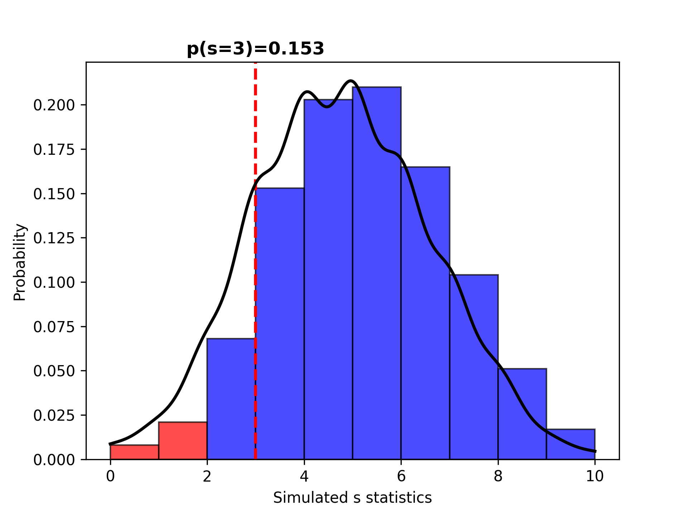

# Phenotype evolution probability Under Neutral Coalescent (PhUNC)

This is a python tool to simulate a hypothetical nuclear locus that controls a phenotypic character under the coalescent process and to calculate the probability of this character to be fixed in alternate states on different populations. The method was first proposed by [Masta & Maddison (2002)](https://doi.org/10.1073/pnas.072493099) and this program was used in [Azevedo et al. (in prep)](). The model assumes that the phenotypic states of the character is controlled by a single mutation in one locus and that the mutation rate is the slowest possible (parsimony).  
The program can be used to assess the probability of drift leading to fixation, using number of traits = number of species in tree, or to evaluate the probability of different hemiplasy scenarios using binary state with more than two species. 

If you use this program, please cite [Azevedo et al. (in prep)]() and refer to [this github page](https://github.com/ghfazevedo/phenofun).

## Installation

This program uses [DendroPy](https://jeetsukumaran.github.io/DendroPy) library that is installed automatically as a dependency.
Please cite [DendroPy](https://jeetsukumaran.github.io/DendroPy).

To install PhUnC clone this github page and use pip.

```
git clone https://github.com/ghfazevedo/phenofun
cd phenofun
pip install .
```

## Example usage
```bash
phenofun -t data/tree.nwck -n 1000 -s 10,10,10,10 -ts 3
```

You can also provide a trait matrix (tab delimited) if you want to use a number of states that is different from the total amount of species in the species tree. This can be useful to relax the assumptions that all states must be fixed, to use polymorphisms or uncertain coding ([0,1] meaning 0 or 1), or to explore probabilities of differen hemiplasic scenarios.

```bash
phenofun -t data/tree.nwck -n 1000 -s 10,10,10,10 -ts 2 -p data/phenotype_map.txt -o phenofun_out_wMatrix
```

## Outputs
The program print the probability of the target *s* to the terminal and creates the files:
1. [S_statsProbs](phenofun_out/S_statsProbs.txt) with the probability of the observed s statistics provided.
2. [simulated_gene_trees.nwck](phenofun_out/simulated_gene_trees.nwck) with all simulated trees.
3. [target_gene_trees.nwck](phenofun_out/target_gene_trees.nwck) with only gene trees that show the target *s*.
4. [simulated_s.csv](phenofun_out/simulated_s.csv) with all values of *s* for all simulations.
5. [histogram.pdf](phenofun_out/histogram.pdf) and [histogram.png](phenofun_out/histogram.png) which are the histogram plots with PDF estimated curve, with the inferior 5% inferior percentile marked in red, and with a vertical red line showing the target *s* value. 

6. [barplot.pdf](phenofun_out/histogram.pdf) and [barplot.png](phenofun_out/histogram.png) which are the plot with probability of target s given drift and probability of s being different from target. 


## Command Options

```
usage: phenofun [-h] -t TREE [-o OUT_DIR] [-n N_SIMULATIONS] -s N_SAMPLED_INDIVIDUALS -ts TARGET_S_STATISTICS [-p PHENOTYPE_MAP] [-v]

Calculates the probability of fixation of differences in a hypothetical nuclear locus that controls phenotype under neutral divergence.

options:
  -h, --help            show this help message and exit
  -t TREE, --tree TREE  Path to the population/species tree with population size as branch annotations (Nexus format)
  -o OUT_DIR, --out_dir OUT_DIR
                        Output directory
  -n N_SIMULATIONS, --n_simulations N_SIMULATIONS
                        Number of gene trees to simulate.
  -s N_SAMPLED_INDIVIDUALS, --n_sampled_individuals N_SAMPLED_INDIVIDUALS
                        The number of individuals per population/species separated by comma. It should be in the same order as the populations appear
                        in the species tree file.
  -ts TARGET_S_STATISTICS, --target_s_statistics TARGET_S_STATISTICS
                        The target s statistics as observed in the real world data to calculate the probability of generating it through the
                        simulations.
  -p PHENOTYPE_MAP, --phenotype_map PHENOTYPE_MAP
                        Optional: Path to a tab-separated file associating species in the tree with phenotype codes. Format: one line per species,
                        e.g. 'species1 0', 'species2 0', 'species3 1', 'species4 [0,1]'. Use [0,1] for uncertain or polymorphic states. If provided,
                        this file will be used to assign phenotype states to taxa instead of default coding.
  -v, --version         show program's version number and exit
```

